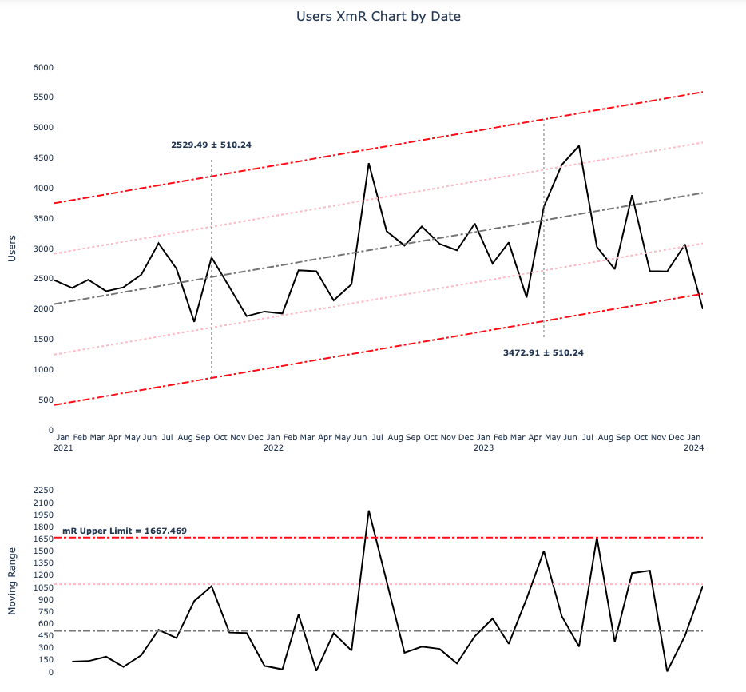

# spc_plotly

**spc_plotly** is a Python helper library for creating XmR Charts according to the theories of Statistical Process Control using the Plotly library.

XmR Charts allow the viewer to quickly identify signals in a data set and ignore routine variation.

## Installation

```shell
pip install spc-plotly
```

## Usage

```python
from spc_plotly import xmr
import pandas as pd

counts = [
    2478, 2350, 2485, 2296, 2359, 2567, 3089, 2668, 1788, 2854, 
    2365, 1883, 1959, 1927, 2640, 2626, 2144, 2409, 4412, 3287, 
    3049, 3364, 3078, 2972, 3415, 2753, 3102, 2191, 3693, 4385, 
    4699, 3031, 2659, 3885, 2628, 2621, 3071, 2002
]
periods = [
    '2021-01', '2021-02', '2021-03', '2021-04', '2021-05', '2021-06', 
    '2021-07', '2021-08', '2021-09', '2021-10', '2021-11', '2021-12',
    '2022-01', '2022-02', '2022-03', '2022-04', '2022-05', '2022-06',
    '2022-07', '2022-08', '2022-09', '2022-10', '2022-11', '2022-12', 
    '2023-01', '2023-02', '2023-03', '2023-04', '2023-05', '2023-06',
    '2023-07', '2023-08', '2023-09', '2023-10', '2023-11', '2023-12',
    '2024-01', '2024-02'
]
data = pd.DataFrame({
    "Period": periods,
    "Count": counts
})

xmr_chart = xmr.XmR(
    data=data,
    x_ser_name="Period",
    y_ser_name="Count",
    x_cutoff="2023-06",
    date_part_resolution="month", # This should match your data
    custom_date_part="",
    xmr_function="mean"
)

xmr_chart.mR_limit_values
# {
#   'mR_xmr_func': 571.8918918918919,
#   'mR_upper_limit': 1868.9427027027025,
#   'xmr_func': 'mean'
# }
xmr_chart.npl_limit_values
# {
#   'y_xmr_func': 2820.6315789473683,
#   'npl_upper_limit': 4341.864011379801,
#   'npl_lower_limit': 1299.3991465149359,
#   'xmr_func': 'mean'
# }
xmr_chart.signals
# {'anomalies': [(datetime.datetime(2022, 7, 1, 0, 0), 4412, 'High'),
#   (datetime.datetime(2023, 6, 1, 0, 0), 4385, 'High'),
#   (datetime.datetime(2023, 7, 1, 0, 0), 4699, 'High')],
#  'long_runs': [[('2021-11', 2365, 'Low'),
#    ('2021-12', 1883, 'Low'),
#    ('2022-01', 1959, 'Low'),
#    ('2022-02', 1927, 'Low'),
#    ('2022-03', 2640, 'Low'),
#    ('2022-04', 2626, 'Low'),
#    ('2022-05', 2144, 'Low'),
#    ('2022-06', 2409, 'Low')]],
#  'short_runs': [[('2023-04', 2191, 'High'),
#    ('2023-05', 3693, 'High'),
#    ('2023-06', 4385, 'High'),
#    ('2023-07', 4699, 'High'),
#    ('2023-08', 3031, 'High')],
#   [('2021-11', 2365, 'Low'),
#    ('2021-12', 1883, 'Low'),
#    ('2022-01', 1959, 'Low'),
#    ('2022-02', 1927, 'Low'),
#    ('2022-03', 2640, 'Low')]]}

xmr_chart.xmr_chart
```

<!--  -->

For reference, please read [Making Sense of Data by Donald Wheeler](https://www.amazon.com/Making-Sense-Data-Donald-Wheeler/dp/0945320728) and [Twenty Things You Need To Know](https://www.amazon.com/Twenty-Things-You-Need-Know/dp/094532068X)


### Sloped Limits

Some data naturally increases over time, e.g., price of some goods. When modeling this data, you should use sloped limit lines to identify signals.

```python
xmr_chart = xmr.XmR(
    data=data,
    x_ser_name="Period",
    y_ser_name="Count",
    x_cutoff="2023-06",
    xmr_function="mean"
    sloped=True
)
```

<!--  -->


### Use the Median

If your data contains extreme outliers, you can update the xmr_function parameter to "median"

```python
xmr_chart = xmr.XmR(
    data=data,
    x_ser_name="Period",
    y_ser_name="Count",
    x_cutoff="2023-06",
    xmr_function="median"
    sloped=False
)
```

### Calculate Limits from Subset of Data

If you want to calculate the limits from a subset of your data, use the x_cutoff parameter.

```python
xmr_chart = xmr.XmR(
    data=data,
    x_ser_name="Period",
    y_ser_name="Count",
    x_cutoff="2023-06",
    xmr_function="median"
    sloped=False
)
```
This will include all data up to, and including, "2023-06". If no value is passed, the limits will be calculated using all data.
Currently, this does not support an _x_start_, so I would recommend filtering the passed-in dataframe to start at the desired period.

## Dependencies
Plotly, Pandas, and Numpy